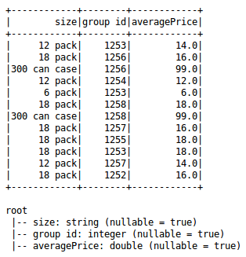

spark-sql-java-api-udf
----------------------
The main class ``SparkCSVIngest`` is a Spark SQL Java API snippet to query a sparse CSV Dataset of beverages. It extends a ``SparkRunner`` class that enables ``log4j`` at runtime. The bytecode is generated using Spark version 2.3.0 and Scala version 2.11.8 (OpenJDK 64-bit Server VM). 

The ``SparkSession`` here operates on an aggregated Dataset and calls a user-defined function to affix a ``readableID`` for each entry, while ordering by the average price on the aggregated Dataset. Here's a peek into all of the transformations:

- The raw Dataset ``(csv)`` is created by calling the ``read`` function of the ``SparkSession.``
- The aggregated Dataset ``(agg)`` is built using the ``filter`` function on the ``csv`` as a typed ``FilterFunction<Row>.`` After a ``groupBy`` it invokes ``sql.functions`` API to add an average price.
- A UDF method is included ``(spark.udf())`` that instantiates ``api.java.UDF1`` to set a ``readableId`` of ``StringType`` for each ``Integer`` entry ID.
- The final Dataset ``ordered`` builds upon ``agg,`` invokes ``sql.functions`` on it to transform its ID with the ``callUDF`` method, and later orders it by its average price column.

Here's a view of the new ``agg`` Dataset:

Top few lines of the logical plan trace for ``ordered.explain(true)`` come as:

::

    == Analyzed Logical Plan ==
        size: string, group id: int, averagePrice: double, readableId: string
        Sort [averagePrice#49 DESC NULLS LAST], true
            +- Project [size#13, group id#11, averagePrice#49, UDF:readableId(group id#11) AS readableId#73]
                +- Aggregate [size#13, group id#11], [size#13, group id#11, avg(cast(price#12 as bigint)) AS averagePrice#49]
